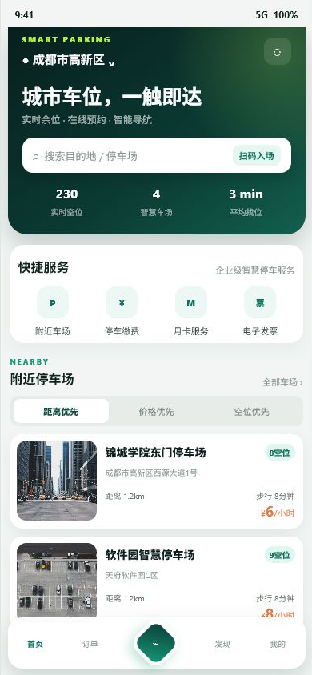
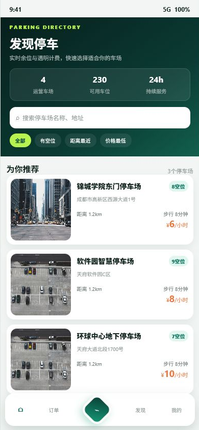
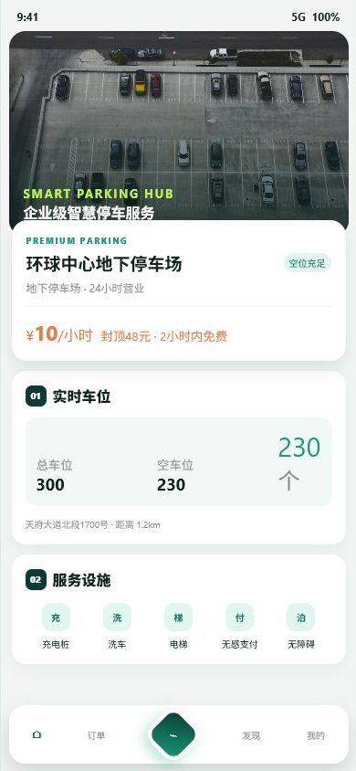
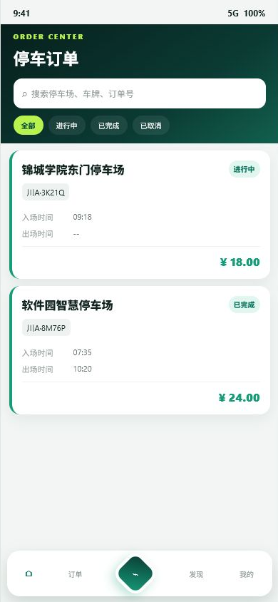
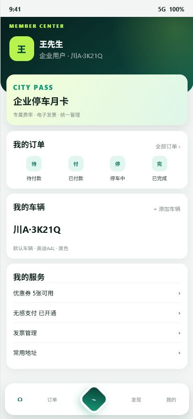

# 智慧停车微信小程序

## 项目简介

智慧停车微信小程序是一个为用户提供停车位查询、预约、支付等功能的移动应用。用户可以通过小程序快速找到附近的停车场，查看实时车位信息，并进行在线支付。

## 页面预览

| 首页 | 车场目录 | 车场详情 |
|---|---|---|
|  |  |  |

| 订单中心 | 车主中心 |
|---|---|
|  |  |

视觉升级以企业级智慧出行为目标：深绿品牌主色、统一圆角卡片、数据指标前置，并强化主操作按钮与状态标签的可识别性。

## 功能特性

### 核心功能

1. **首页**
   - 轮播图展示
   - 快捷入口导航
   - 附近停车场推荐
   - 搜索功能

2. **停车场列表**
   - 附近停车场展示
   - 距离排序
   - 价格排序
   - 空位排序
   - 搜索筛选

3. **停车场详情**
   - 详细信息展示
   - 实时车位状态
   - 导航功能
   - 预约停车

4. **订单管理**
   - 订单列表
   - 订单详情
   - 支付功能
   - 订单状态跟踪

5. **个人中心**
   - 用户信息
   - 我的车辆
   - 历史记录
   - 优惠券
   - 发票管理
   - 意见反馈
   - 关于我们

## 技术栈

- **前端框架**: 微信小程序原生框架
- **UI组件**: 自定义组件
- **状态管理**: 小程序全局数据
- **网络请求**: 封装的request工具
- **地图服务**: 腾讯地图

## 项目结构

```
miniprogram/
├── pages/                  # 页面文件
│   ├── index/             # 首页
│   │   ├── index.js
│   │   ├── index.json
│   │   ├── index.wxml
│   │   └── index.wxss
│   ├── login/             # 登录页
│   ├── register/          # 注册页
│   ├── parking-lots/      # 停车场列表
│   ├── parking-detail/    # 停车场详情
│   ├── orders/            # 订单页
│   └── profile/           # 个人中心
├── utils/                 # 工具函数
│   ├── request.js        # 网络请求封装
│   └── util.js           # 通用工具函数
├── images/                # 图片资源
├── app.js                 # 小程序入口
├── app.json               # 全局配置
├── app.wxss               # 全局样式
├── project.config.json    # 项目配置
└── sitemap.json           # 站点地图
```

## 快速开始

### 1. 环境准备

- 下载并安装 [微信开发者工具](https://developers.weixin.qq.com/miniprogram/dev/devtools/download.html)
- 注册微信小程序账号，获取 AppID

### 2. 配置项目

1. 打开微信开发者工具
2. 导入项目，选择 `miniprogram` 目录
3. 在 `project.config.json` 中修改 `appid` 为你的小程序 AppID
4. 在 `app.js` 中修改 `baseUrl` 为你的后端API地址

真机调试时不要使用 `localhost` 或 `127.0.0.1`。
手机访问这两个地址时，请求到的是“手机自己”，不是开发电脑。
如果后端跑在你的电脑上，请把开发地址改成电脑在当前局域网里的 IPv4 地址，例如 `http://192.168.1.8:8081/api`。

```javascript
// app.js
globalData: {
  userInfo: null,
  token: null,
  baseUrl: 'http://192.168.1.8:8081/api' // 修改为你的电脑局域网地址
}
```

真机调试补充检查：

1. 手机和电脑连接同一个 Wi-Fi
2. 后端服务已经启动，并监听 `8081` 端口
3. Windows 防火墙允许 Java 或 `8081` 入站访问
4. 微信开发者工具已勾选“开发环境不校验请求域名、TLS 版本及 HTTPS 证书”

### 3. 运行项目

1. 在微信开发者工具中点击"编译"
2. 在模拟器中预览小程序
3. 点击"预览"生成二维码，在手机上扫码体验

## API接口说明

### 用户相关

- `POST /users/login` - 用户登录
- `POST /users/register` - 用户注册
- `POST /users/wechat-login` - 微信登录
- `GET /users/stats` - 获取用户统计信息

### 停车场相关

- `GET /parking-lots` - 获取停车场列表
- `GET /parking-lots/nearby` - 获取附近停车场
- `GET /parking-lots/:id` - 获取停车场详情
- `GET /parking-lots/:id/spaces` - 获取停车场车位

### 订单相关

- `GET /orders` - 获取订单列表
- `POST /orders` - 创建订单
- `PUT /orders/:id/pay` - 支付订单
- `PUT /orders/:id/cancel` - 取消订单

## 页面说明

### 首页 (index)

首页展示轮播图、快捷入口和附近停车场列表。支持获取用户位置，显示距离最近的停车场。

### 停车场列表 (parking-lots)

展示所有停车场，支持搜索、排序和筛选。可以按距离、价格、空位数量排序。

### 停车场详情 (parking-detail)

展示停车场的详细信息，包括地址、收费标准、车位状态等。支持导航到停车场。

### 订单页 (orders)

展示用户的停车订单，支持查看订单详情、支付订单、取消订单等操作。

### 个人中心 (profile)

展示用户信息和统计数据，提供我的车辆、历史记录、优惠券等功能入口。

## 注意事项

1. **域名配置**: 在小程序后台配置合法域名
2. **位置权限**: 需要在 `app.json` 中配置位置权限说明
3. **用户隐私**: 获取用户手机号需要用户授权
4. **支付功能**: 需要开通微信支付功能

## 开发建议

1. **代码规范**: 遵循微信小程序开发规范
2. **性能优化**: 使用防抖、节流优化频繁操作
3. **错误处理**: 统一处理网络请求错误
4. **用户体验**: 添加加载状态、空状态提示

## 更新日志

### v1.0.0 (2026-02-26)

- ✅ 完成首页、停车场列表、订单、个人中心等核心页面
- ✅ 实现用户登录、注册功能
- ✅ 实现停车场查询、详情展示
- ✅ 实现订单管理功能
- ✅ 封装网络请求工具
- ✅ 实现位置服务和距离计算

## 联系方式

如有问题或建议，请联系开发团队。
